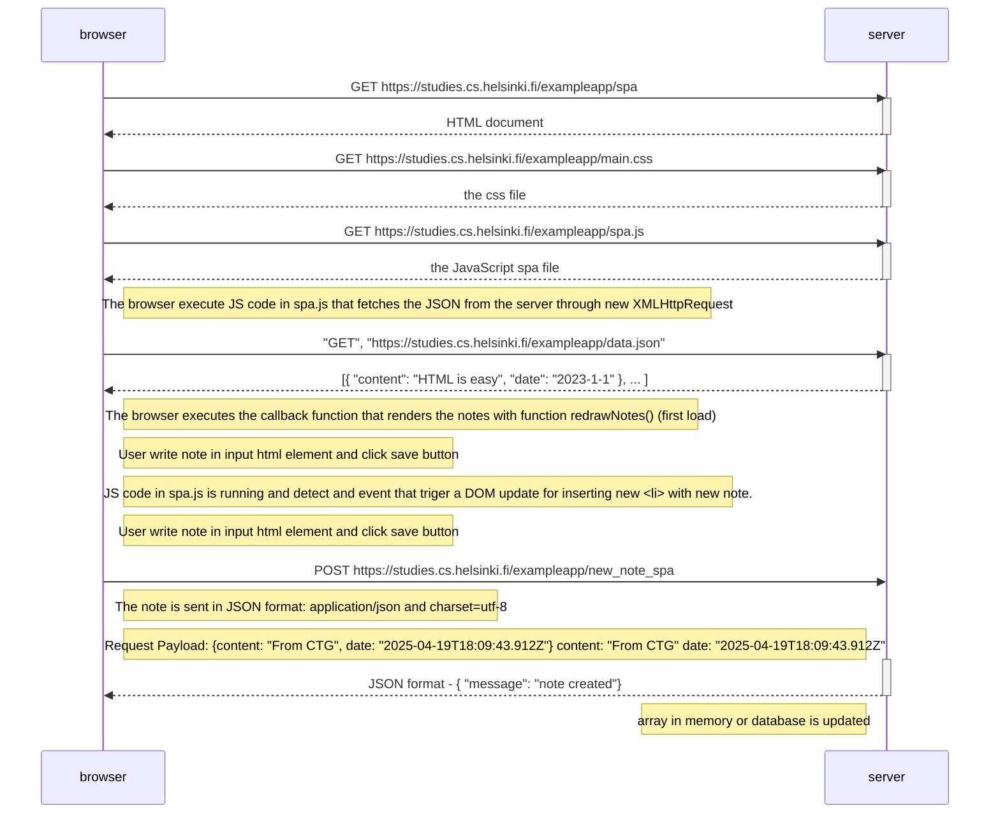

```mermaid
sequenceDiagram
    participant browser
    participant server

    browser->>server: GET https://studies.cs.helsinki.fi/exampleapp/spa

    activate server
    server-->>browser: HTML document
    deactivate server

    browser->>server: GET https://studies.cs.helsinki.fi/exampleapp/main.css

    activate server
    server-->>browser: the css file
    deactivate server

    browser->>server: GET https://studies.cs.helsinki.fi/exampleapp/spa.js

    activate server
    server-->>browser: the JavaScript spa file
    deactivate server

    Note right of browser: The browser execute JS code in spa.js that fetches the JSON from the server through new XMLHttpRequest 

    browser->>server: "GET", "https://studies.cs.helsinki.fi/exampleapp/data.json"
    
    activate server
    server-->>browser: [{ "content": "HTML is easy", "date": "2023-1-1" }, ... ]
    deactivate server

    Note right of browser: The browser executes the callback function that renders the notes with function redrawNotes() (first load)

    Note right of browser: User write note in input html element and click save button

    
    Note right of browser: JS code in spa.js is running and detect and event that triger a DOM update for inserting new <li> with new note. 

    
    Note right of browser: User write note in input html element and click save button
    
    browser->>server: POST https://studies.cs.helsinki.fi/exampleapp/new_note_spa

    Note right of browser: The note is sent in JSON format: application/json and charset=utf-8

    Note right of browser: Request Payload: {content: "From CTG", date: "2025-04-19T18:09:43.912Z"} content: "From CTG" date: "2025-04-19T18:09:43.912Z"

    activate server
    server-->>browser: JSON format - { "message": "note created"}
    deactivate server

    Note left of server: array in memory or database is updated

```